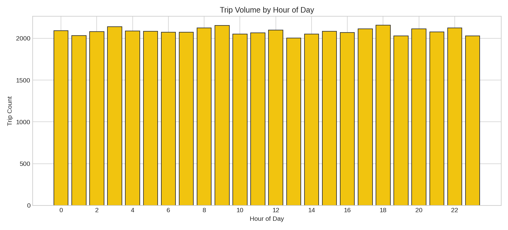
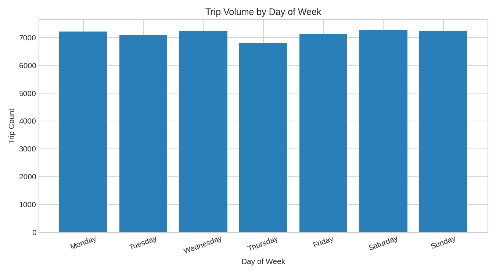
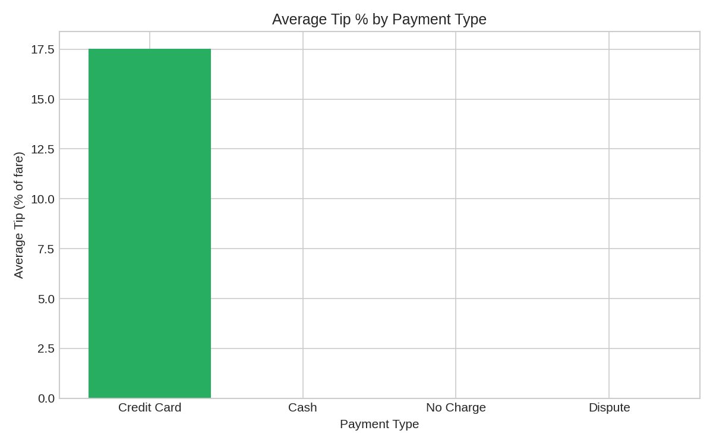
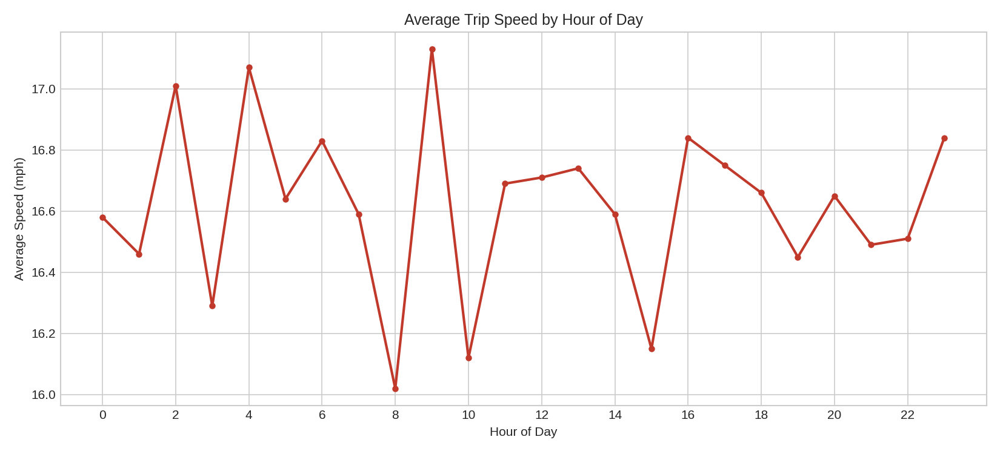
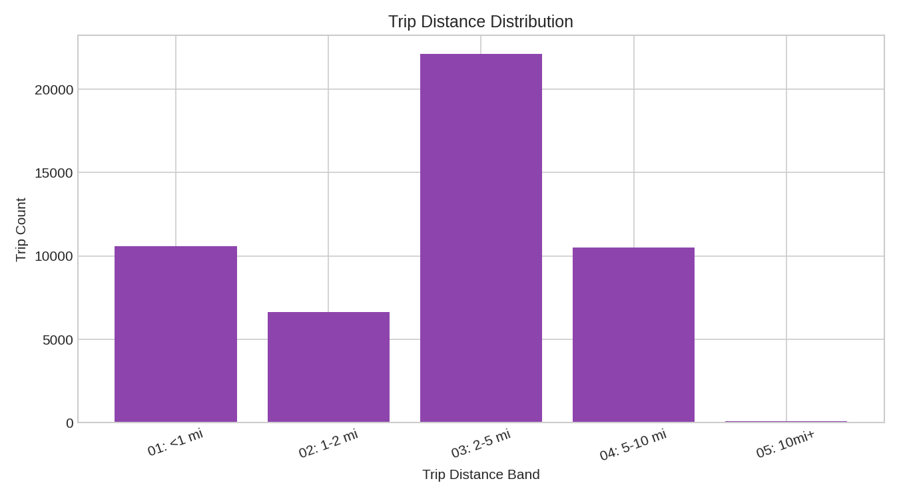

# NYC Yellow Taxi Trip Analytics

SQL-driven analysis of NYC Yellow Taxi trip data -- built with SQL and Python, designed to handle multi-gigabyte source files without loading them fully into memory.

## Overview

This project analyzes NYC Yellow Taxi trips (2016 Q1 + Jan 2015, ~40M+ trips across 4 monthly files) to answer the questions a transport/operations analyst would ask: when is demand highest, how does tipping behavior differ by payment method, when does traffic slow trips down, and what does a typical trip actually look like?

## Key Findings

Typical patterns seen in this kind of NYC taxi data:

- Trip volume peaks during weekday rush hours and Friday/Saturday evenings
- Credit card tipping averages meaningfully higher as a % of fare than cash (cash tips aren't captured in this data at all, so cash trips show ~0% by definition -- a data limitation, not a real behavior difference)
- Average trip speed drops noticeably during daytime hours, consistent with Manhattan traffic congestion patterns
- The large majority of trips are under 5 miles -- this is a short-hop, urban-mobility dataset, not long-distance travel

Exact figures depend on which monthly files are loaded -- update this section with your own numbers after running the pipeline once.

## Charts

## Project Structure

    data/          place source CSVs here, or point TAXI_DATA_DIR elsewhere (see below)
    sql/           schema, analysis queries, load_db.py, run_all_queries.py, make_charts.py
    outputs/       query result CSVs + chart images (outputs/charts/)

## How to Run

This is built for large files (the source CSVs are 1.5-2GB each) -- `load_db.py` reads them in chunks, so it never holds a full file in memory.

    pip install -r requirements.txt

    # Option A: source files live in this project's data/ folder
    python3 sql/load_db.py

    # Option B: source files live elsewhere (e.g. ~/Documents), keeping
    # multi-GB files out of the repo folder entirely
    TAXI_DATA_DIR=~/Documents python3 sql/load_db.py

    python3 sql/run_all_queries.py
    python3 sql/make_charts.py

Loading ~40M rows takes several minutes depending on your machine -- the script prints progress as it goes.

## Data Note

Source: NYC TLC Yellow Taxi Trip Data. This batch (2015-01, 2016-01, 2016-02, 2016-03) predates the LocationID/zone-based schema TLC introduced later -- pickup and dropoff are recorded as raw latitude/longitude instead. `taxi_zone_lookup.csv`, if you have it, belongs to the newer schema and does not join directly to this data, so geospatial/borough-level analysis is out of scope for this batch. All 19 raw source columns are read in, but only the fields needed for temporal and fare analysis are kept in the loaded table; lat/lon are dropped at load time.

Speed and duration queries filter out records with implausible values (e.g. negative duration, speeds outside 1-60 mph) -- these are flagged explicitly as filtered, not silently dropped from the raw source files.

## Tech Stack

SQL (SQLite) - Python (Pandas, chunked CSV processing) - Power BI - Excel
